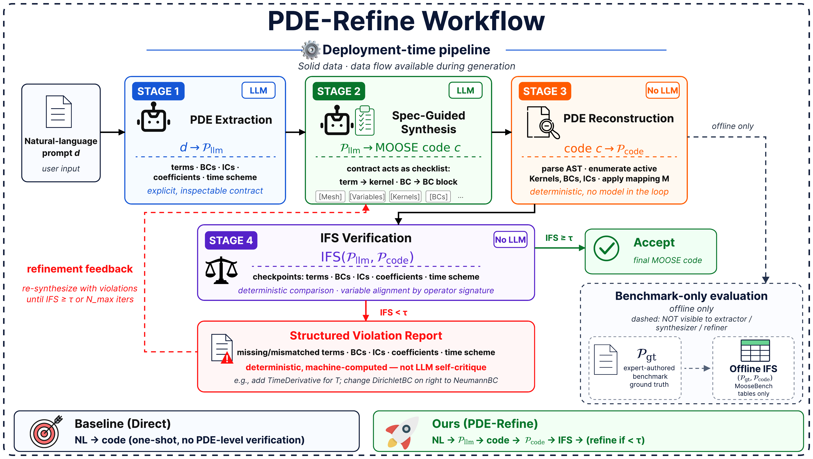
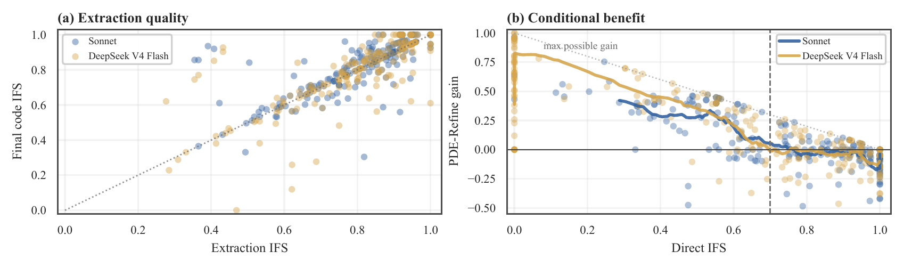

# PDE-Refine

<p align="center">
  <a href="https://arxiv.org/abs/2605.09360"></a>
  <a href="https://arxiv.org/pdf/2605.09360"></a>
  
  
</p>

<p align="center">
  <strong>MooseBench + IFS artifact for PDE-Refine</strong><br>
  <em>Intent-fidelity verification for LLM-generated multiphysics simulation code</em>
</p>

<p align="center">
  <a href="https://arxiv.org/abs/2605.09360"><strong>Read the paper on arXiv</strong></a>
</p>

This repository contains the clean artifact for the submitted paper experiments.

**TL;DR.** LLM-generated MOOSE simulations can execute while encoding the wrong
PDE. This artifact releases the deterministic PDE reconstruction / Intent
Fidelity Score (IFS) stack, the clean 220-case MooseBench benchmark, the
release-format per-case evaluation records, compact aggregate paper-table
summaries, representative generated-code examples, and final derived figures.
Full prompts, complete input files, the machine-readable Kernel--PDE map, full
LLM run JSONLs, execution-audit JSONs, provider logs, and generated-code caches
are not included in this lightweight release package.

## Paper Overview

The workflow below shows how PDE-Refine turns deterministic intent-fidelity
violations into targeted code repairs, separating "the simulation runs" from
"the simulation solves the intended physics."

<p align="center">
  <a href="artifacts/pde_refine_workflow_v2.pdf">
    
  </a>
</p>

The compact diagnostic view summarizes where the pipeline surfaces physics
mismatches that execution-only checks can miss.

<p align="center">
  <a href="artifacts/pipeline_diagnostics_compact.pdf">
    
  </a>
</p>

## Quick Start

No API key is needed for the validation commands below:

```bash
uv sync --group dev
uv run python scripts/validate_moosebench.py
python -m json.tool results/derived/main_tables.json | head -n 40
wc -l results/derived/eval_records.jsonl
```

Expected validation summaries:

- `scripts/validate_moosebench.py`: 220 OK, 0 FAIL.

## Contents

| Artifact | Path | Purpose |
|---|---|---|
| PDE / IFS / MCS engine | `src/codmos/multiagent/pde/` | Deterministic MOOSE-to-physics reconstruction and intent-fidelity scoring. |
| Object-realization control layer | `src/codmos/multiagent/object_realization.py` | Frozen registry support used for execution-control comparisons. |
| MooseBench release | `experiments/moosebench_clean/` | Clean 220-case benchmark contracts and source MOOSE inputs. |
| Kernel--PDE mapping | By request | Machine-readable operator, severity, coefficient, equivalence, and source-traceability map; email the authors for access. |
| Aggregate table summaries | `results/derived/main_tables.json` | Compact final paper-table values only; no per-case generations or repair metadata. |
| Per-case evaluation records | `results/derived/eval_records.jsonl` | Release-format fields for core standard, deployment, weak-model, and mixed-model aggregates; no code paths, provider logs, or repair traces. |
| Representative generated examples | `examples/generated/` | Three paired Exec-Repair+Reg vs PDE-Reg generated `.i` examples that pass InitExec2 and show IFS improvements. |
| README visual artifacts | `artifacts/` | Paper workflow and compact diagnostic figures as source PDFs plus rendered PNGs for GitHub display. |
| Derived diagnostics | `results/derived/` | Small IFS/L2 and MCS diagnostic inputs for figure regeneration. |
| Final figures | `results/figures/` | Released paper figures retained for inspection. |
| Scripts | `scripts/` | Validation, analysis, execution-audit, and figure-generation utilities. |
| Tests | `tests/` | Unit tests for reconstruction, IFS/MCS, mapping, validators, and variants. |

## Reproducing Paper Artifacts

The artifact includes executable code and compact derived summaries. Commands
that require full run JSONLs expect the user to provide those files under
`RESULT_DIR`.

```bash
RESULT_DIR=experiments/results/current
```

| Paper artifact | Command | Requires full run JSONLs? |
|---|---|---|
| Clean MooseBench integrity | `uv run python scripts/validate_moosebench.py` | No |
| Main paper table summaries | `python -m json.tool results/derived/main_tables.json` | No |
| Per-case table records | `jq -s 'group_by([.table,.model,.method,.extractor,.generator,.comparison_pair])[] | {table:.[0].table, model:.[0].model, method:.[0].method, extractor:.[0].extractor, generator:.[0].generator, n:length, mean_ifs:(map(.ifs)|add/length)}' results/derived/eval_records.jsonl` | No |
| Compact pipeline / execution figures | `uv run python scripts/generate_paper_figures.py --results-dir "$RESULT_DIR"` | Yes |
| IFS/MCS validation and MCS repair figures | `uv run python scripts/generate_mcs_blindspot_figures.py --blindspot-csv results/derived/mcs_blindspots_gpt54_ds_v4.csv --repair-summary results/derived/mcs_repair_smoke_summary_v3.jsonl --l2-data results/derived/ifs_vs_l2_data.json --output-dir results/figures` | No |
| Mixed-model 2x2 diagnostics | `uv run python scripts/generate_mixed_llm_figures.py --pair gpt-deepseek --results-dir "$RESULT_DIR"` | Yes |
| InitExec2 execution audit | `uv run python scripts/audit_moose_execution_rate.py --results "$RESULT_DIR/merged220_deepseek-flash_regexec.jsonl" --moose-app /path/to/combined-opt --output results/derived/deepseek_initexec2.json --timeout 2 --pass-on-solve-start --workers 4` | Yes, plus local MOOSE |

## MOOSE Execution Environment

The execution-audit results reported in the paper used the MOOSE `combined-opt`
application built from a clean local MOOSE checkout:

- branch: `next`
- commit: `541a9f6fd0376adca9136adb5a279f0d0addad85`
- commit date: `2026-04-27 19:28:08 +0200`

The artifact does not bundle MOOSE itself. To rerun execution audits, provide a
compatible local `combined-opt` binary through the `--moose-app` argument.

## MooseBench Dataset Card

`experiments/moosebench_clean/` is the canonical benchmark release:

- `index.json` names the active 220 cases and is the only shipped benchmark
  index.
- `ground_truth/` contains PDE-level ground-truth contracts.
- `source_files/` contains the corresponding reference MOOSE input files.

The full MooseBench package is not uploaded to this lightweight repository yet.
If you need the full prompts, complete input files, or the machine-readable
Kernel--PDE map, email `zs448@cornell.edu` or `yl3825@cornell.edu`; we will
send the files when we see the request. Use of the dataset requires citing the
source paper:
[arXiv:2605.09360](https://arxiv.org/abs/2605.09360).

Older benchmark snapshots and full benchmark-plus-exclude-list layouts are not
part of this release package. Validate the release with:

```bash
uv run python scripts/validate_moosebench.py
```

## Kernel--PDE Mapping

The paper describes the Kernel--PDE mapping from covered MOOSE Kernel / BC / IC
classes to normalized PDE operator types, including severity weights,
coefficient extraction metadata, equivalence groups, and source-document
traceability. The machine-readable mapping file is not included in this
lightweight repository yet; email `zs448@cornell.edu` or `yl3825@cornell.edu`
for access.

## Citation

If you use MooseBench, the IFS implementation, or the released artifacts, please
cite:

```bibtex
@misc{song2026simulationrunswrongphysics,
  title         = {Your Simulation Runs but Solves the Wrong Physics: PDE-Grounded Intent Verification for LLM-Generated Multiphysics Simulation Code},
  author        = {Zhenghan Song and Yulong Liu and others},
  year          = {2026},
  eprint        = {2605.09360},
  archivePrefix = {arXiv},
  primaryClass  = {cs.LG},
  url           = {https://arxiv.org/abs/2605.09360}
}
```

## Quick Demo

The snippet below reconstructs the PDE encoded by one shipped MOOSE input and
computes the self-IFS score. It uses no LLM and no API key.

```bash
uv run python -c "import sys; sys.path.insert(0, 'src'); from pathlib import Path; from codmos.multiagent.pde import compute_ifs, reconstruct_pde; case='diffusion_001'; code=(Path('experiments/moosebench_clean/source_files') / f'{case}.i').read_text(); pde=reconstruct_pde(code); result=compute_ifs(pde, pde); print(f'{case}: terms={len(pde.terms)}, BCs={len(pde.boundary_conditions)}, IFS={result.ifs_score:.3f}')"
```

`examples/generated/metadata.json` describes the retained generated-code pairs.
Each pair includes an execution-only baseline and the corresponding PDE-Reg
output for the same case, with final IFS and InitExec2 pass status.

## Release Package Scope

- Full LLM run JSONLs, cached responses, execution-audit JSONs, provider logs,
  full generated-code caches, and large MOOSE side-output files are not part of
  the lightweight release package. The retained `eval_records.jsonl` is a
  release-format per-case export containing only table-reproduction fields.
- Raw silent-failure gallery simulations and MOOSE side outputs are represented
  by compact derived IFS/L2 data and final figures.
- Old benchmark snapshots, full benchmark-plus-exclude-list layouts, old
  mixed-model result caches, and obsolete intermediate figures are not included.
- DSL/UFL framework extensions, fine-tuning/SFT code, local agent memory,
  submission source files, unreleased local workspaces, and unpublished
  exploratory experiments are outside this package.
- API keys and local machine-specific execution products are not included.

## Setup Notes

Plain Python installation is also supported:

```bash
python -m pip install -e '.[dev]'
```

LLM generation scripts require the relevant provider environment variables
(`OPENAI_API_KEY`, `DEEPSEEK_API_KEY`, `ANTHROPIC_API_KEY`, or
`GEMINI_API_KEY`). The validation commands and retained derived summaries do not
require provider credentials.
